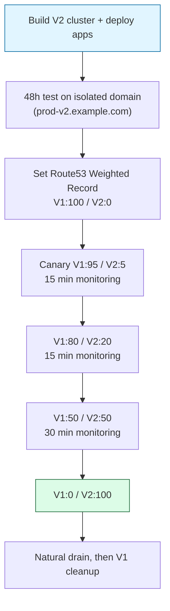

> **Timeline** · Q1 2026  
> **Environment** · AWS EKS 1.32/1.33 → 1.35, AL2 → AL2023  
> **Currency** · USD (2026 Q1)

## ~49% Reduction Summary

While the [previous post](/en/blog/k8s-small-cluster-cost-optimization/) covered incremental adjustments to a small cluster already in production, this post is the story of choosing to decommission V1 and build V2 from scratch to break free from accumulated infrastructure debt.

| | V1 (Before) | V2 (After) | Savings |
|---|---:|---:|---:|
| Production | $5,114/mo | $2,295/mo | −$2,819 (55%) |
| Development | $1,483/mo | $1,063/mo | −$420 (28%) |
| **Total** | **~$6,598/mo** | **~$3,358/mo** | **~−$3,240/mo (~49%)** |

Annualized savings: ~$38,880. The work breaks down into seven patterns.

1. **New V2 cluster build to clear accumulated debt** (EKS 1.32/1.33 → 1.35, ArgoCD v1 → v3, Kafka Zookeeper → KRaft, etc.)
2. **Node group consolidation** (PROD: 9 groups/25 nodes → 5 groups/15 nodes)
3. **Excluding STG from V2** (deciding what not to migrate)
4. **Enforcing nodeSelector policy + consolidating kube-system controllers to ops nodes**
5. **Right-sizing based on 28 days of Mimir data** (Kafka and ops node downsizing)
6. **Observability cardinality control** (60% reduction in Mimir series)
7. **Zero-downtime cutover with Route53 Weighted Routing**

The entire cutover was **fully zero-downtime** by external health check.

## Environment Profile

### V1 (Before Migration)

| Cluster | EKS | Nodes | Node Groups | Instance Composition |
|---|---|---|---|---|
| PROD | 1.32 (AL2) | 25 | 9 | m6i.xlarge × 16, m6i.2xlarge × 3, m7i.xlarge × 5, other × 1 |
| DEV | 1.33 (AL2) | 9 | 3 | t3.xlarge × 5, m6i.xlarge × 4 |

### V2 (After Migration)

| Cluster | EKS | Nodes | Node Groups | Instance Composition |
|---|---|---|---|---|
| PROD | 1.35 (AL2023) | 15 | 5 | m6i.xlarge × 9 (backend/kafka/tenant), m6i.large × 4 (vendor), t3.xlarge × 2 (ops) |
| DEV | 1.35 (AL2023) | 10 | 4 | t3.large × 3 (ops), t3.xlarge × 4 (backend·vendor), t3.large × 3 (kafka) |

The production environment runs ~60 ArgoCD apps, 10+ Helm releases, Kafka with 3 brokers + 3 controllers (KRaft), a multi-node Valkey cluster, and more.

## Why In-Place Downsizing Wasn't Enough

All six patterns in the small cluster post involved shrinking instances or right-sizing resources while the existing cluster stayed in place. In this environment, a different category of debt had accumulated that couldn't be reached the same way.

**Version debt.** Moving from EKS 1.32 to 1.35 requires four minor version jumps. EKS only allows one minor version upgrade at a time — 10–20 minutes per control plane hop, more than an hour per step once node pool replacement is included. On top of that, ArgoCD v1 → v3 (two major versions), Loki 2.x → 3.x, Grafana 10 → 12, and Strimzi 0.46 (KRaft-only) were all needed simultaneously.

**Node group debt.** PROD V1 had nine node groups mixing four instance types (m6i.xlarge, m6i.2xlarge, m7i.xlarge, and one other) — each added at different points in time. Role labels and instance specs had drifted out of alignment, making right-sizing impossible without restructuring first.

**Data backend debt.** Migrating Redis 7.x to Valkey 8.x and moving Kafka from Zookeeper to KRaft mode within the same cluster would have required running both data migrations and mode transitions together, with a rollback scope that was far too large.

Building a new cluster and shifting only the traffic was ultimately the safest path.

## 7 Patterns

### 1. New V2 Cluster Build to Clear Accumulated Debt

With the existing cluster left untouched, a separate V2 cluster was built and the following were all addressed in one shot.

| Component | V1 | V2 |
|---|---|---|
| EKS | 1.32 / 1.33 | 1.35 |
| Node AMI | Amazon Linux 2 | AL2023 |
| Secret Encryption | Disabled | KMS enabled |
| ArgoCD | v1.x | v3.2.x |
| Argo Rollouts | v1.8.x | v1.8.x |
| Loki | 2.x (single) | 3.6.x (SimpleScalable + S3) |
| Grafana | 10.x | 12.x |
| OpenSearch | 2.x | 3.x |
| Kafka | Zookeeper mode | KRaft mode (Strimzi 0.46) |
| Redis / Valkey | Redis 7.x | Valkey 8.x |
| AWS LB Controller | v2.x | v3.0.x |
| Cluster Autoscaler | v1.x | v1.35.x |

Doing major version upgrades in a new cluster rather than stepping through them in place is safer and faster for both EKS and ArgoCD. Strimzi 0.46 being KRaft-only made the Kafka migration a natural inflection point — the new cluster was the obvious time to do it.

### 2. Node Group Consolidation

This is where the largest cost reduction came from.

#### Before (PROD V1)

- 25 nodes, 9 node groups
- Four instance types (`m6i.xlarge × 16`, `m6i.2xlarge × 3`, `m7i.xlarge × 5`, other × 1) mixed together
- Role labels and instance specs misaligned from accumulated additions over time

#### After (PROD V2)

- 15 nodes, 5 node groups
- Two instance types (`m6i.xlarge`, `m6i.large`) + ops `t3.xlarge`
- Clear separation by role

| Node Group Role | Instance | Count | Workloads |
|---|---|---:|---|
| `ops` | t3.xlarge | 2 | Monitoring, ArgoCD, Strimzi, Debezium, Kafka UI |
| `backend` | m6i.xlarge | 3 | Main API, batch, processing engine |
| `backend-vendor` | m6i.large | 4 | Isolated external solution workloads |
| `kafka` | m6i.xlarge | 3 | Kafka brokers/controllers (taint: `kafka=true:NoSchedule`) |
| `backend-tenant` | m6i.xlarge | 3 | Tenant-isolated workloads |

Isolating the external solution node group was driven more by isolation requirements than cost, but the ability to use `m6i.large` instances also reduced cost. The Kafka node group is tainted to prevent KRaft controllers and brokers from mixing with other workloads.

#### Savings

PROD billing went from **~$5,114 to ~$2,295/month**. Standardizing instance types also simplified operations.

### 3. Excluding STG from V2

V1 ran a staging node group with several STG apps. The decision was made to exclude STG entirely from the V2 migration scope.

The reasoning:

- Long-running version drift from DEV/PROD with no recent updates
- High maintenance cost relative to actual usage
- Test reliability too low to meaningfully inform decisions

STG was excluded from V2 scope to be rebuilt separately when needed. **Deciding what not to migrate is itself a cost reduction pattern.** The excluded node groups disappear when V1 is eventually decommissioned.

### 4. Enforcing nodeSelector Policy + Consolidating kube-system Controllers to Ops Nodes

After splitting into five node groups, `nodeSelector` was applied explicitly to every workload.

- Each of the five node groups labeled with a `role` value (`ops`, `backend`, `backend-vendor`, `kafka`, `backend-tenant`)
- `nodeSelector` added across all Helm values, ArgoCD manifests, and `kubectl patch` calls
- 100% of pods compliant

Additionally, all kube-system controllers were consolidated onto ops nodes.

| Component | Previous placement | Migration method |
|---|---|---|
| AWS Load Balancer Controller | Spread | Helm `nodeSelector` |
| Cluster Autoscaler | Spread | Helm `nodeSelector` |
| EBS CSI Controller | Spread | EKS Add-on `configurationValues` + SA annotation |
| EFS CSI Controller | Spread | EKS Add-on `configurationValues` + resource reduction |
| opensearch-exporter | Spread | `--set nodeSelector.role=ops` |
| prometheus-operator, kube-state-metrics | Spread | Helm values |
| Strimzi Operator, Debezium, Kafka UI | kafka nodes | `helm upgrade` / `kubectl patch` |

`coredns` and `metrics-server` were intentionally left spread (DNS availability, per-node metrics collection).

#### The EKS Add-on nodeSelector Pitfall

When managing the EBS CSI Controller as an EKS Add-on and adding only `nodeSelector` via `configurationValues`, new pods will not receive IRSA environment variables (`AWS_ROLE_ARN`, `aws-iam-token` projected volume), resulting in `ec2:DescribeAvailabilityZones` 403 errors.

```bash
kubectl annotate sa ebs-csi-controller-sa -n kube-system \
  eks.amazonaws.com/role-arn=arn:aws:iam::<ACCOUNT>:role/<EKS_EBS_ROLE> --overwrite
kubectl delete pod -n kube-system -l app=ebs-csi-controller
```

The `eks.amazonaws.com/role-arn` annotation must be added directly to the ServiceAccount and pods recreated. EFS CSI Controller follows the same pattern.

#### Impact

The direct billing impact is small, but this pattern is a prerequisite for safely running the next two patterns (right-sizing and cardinality control). Predictable workload placement is required before nodes can be removed.

### 5. Right-Sizing Based on 28 Days of Mimir Data

Right-sizing is never done without measured data. 28 days of metrics were extracted from Mimir before making any changes.

#### Kafka Nodes: t3.xlarge × 3 → t3.large × 3

The initial analysis had rated the Kafka nodes as "keep as-is." The reason: total memory requests on the Kafka node in the 2a AZ exceeded the t3.large allocatable of 6.9Gi at 9.7Gi.

Breaking down the root cause revealed that broker over-provisioning (6Gi MEM) combined with non-Kafka workloads (Strimzi operator, Debezium, Kafka UI) running on the same nodes was the culprit.

| Component | CPU req | MEM req | Actual usage |
|---|---|---|---|
| broker | 1,000m | 6,144Mi | ~1,500Mi |
| controller | 200m | 1,024Mi | ~300Mi |
| Strimzi operator | 200m | 256Mi | (movable to ops) |
| Debezium | 500m | 1,024Mi | (movable to ops) |
| Kafka UI | 100m | 256Mi | (movable to ops) |

- Broker MEM 6Gi → 4Gi (based on actual usage of ~1.5Gi)
- `MaxDirectMemorySize` 3g → 1g (sufficient for DEV traffic)
- Non-Kafka workloads moved to ops nodes (Pattern 4)

JVM total: Heap 1,280Mi + DirectMemory 1,024Mi + Metaspace ~300Mi = ~2.6Gi. Safe within 4Gi.

Bin packing validation: 79%/79% under normal conditions; tight but acceptable at 90%/94% in the worst case where anti-affinity breaks and two controllers land on the same node.

KRaft consensus requires a minimum of three nodes, so the node count couldn't be reduced. Only the instance size was halved.

#### Ops Nodes: t3.xlarge × 2 → t3.large × 3

The ops node group was resized by adding nodes while shrinking instance size. Because PVCs are AZ-bound, the AZ distribution of the new node group mattered.

| StatefulSet | PVC | AZ |
|---|---|---|
| opensearch-master-0 | 50Gi | 2a |
| mimir-ingester-0 | 10Gi | 2a |
| mimir-compactor-0 | 10Gi | 2a |
| loki-write-0 | 10Gi | 2a |
| loki-backend-0 | 10Gi | 2a |
| grafana | 10Gi | 2a |
| prometheus-0 | 60Gi | 2c |
| mimir-store-gateway-0 | 5Gi | 2c |
| tempo-0 | 10Gi | 2c |

Specifying two AZ subnets explicitly when creating the node group with eksctl guarantees a 1+2 or 2+1 distribution. Three new nodes (2a × 2 + 2c × 1) accommodated all PVCs.

#### EFS CSI Controller Resource Reduction

The EFS CSI Controller only handles the dynamic provisioning API — actual NFS mounts are handled by the node DaemonSet — so it's safe to significantly reduce its resources.

- Requests: CPU 100m → 50m, MEM 256Mi → 64Mi
- Limits: CPU 200m, MEM 256Mi

#### Orphaned PVC Cleanup

After scaling Kafka brokers from 5 to 3, two orphaned PVCs (100Gi gp3 each) were cleaned up, recovering ~$16/month. Because PV Reclaim Policy was `Delete`, the underlying EBS volumes were also removed.

### 6. Observability Cardinality Control

This started with a "Mimir Ingester memory series limit exceeded" alert entering firing state.

#### Diagnosis

Both DEV and PROD had exceeded the 400K series threshold. The breakdown:

| Source | Series count |
|---|---|
| kubelet | 67K ~ 86K |
| kube-apiserver histogram | ~28K |
| kafka partition metrics (PROD) | ~40K |
| Other | remainder |

#### Remediation

A whitelist-based `writeRelabelConfigs` was applied to ServiceMonitors to restrict ingestion to only the metrics actively in use.

```yaml
spec:
  endpoints:
    - port: http-metrics
      writeRelabelConfigs:
        - sourceLabels: [__name__]
          regex: '(metric_a|metric_b|metric_c|...)'
          action: keep
```

Results:

| Metric | Before | After |
|---|---:|---:|
| Series count (DEV) | >~400K | ~105K |
| Series count (PROD) | >~400K | ~170K |
| `max_global_series_per_user` | 500K | 600K |
| Ingester memory | ~1.5Gi (limit 2Gi) | ~900Mi |

Series count dropped ~60% on average. Alert threshold was adjusted from 400K to 480K (80% of 600K) to stay in sync. Ingester memory entered a stable range without changing any limits.

As a side effect, OpenSearch ISM (Index State Management) retention was standardized to 30 days, reducing index storage costs as well.

### 7. Zero-Downtime Cutover with Route53 Weighted Routing

The biggest advantage of building a parallel cluster is the ability to shift traffic incrementally.

#### Cutover Procedure (PROD)



At each step, error rate and latency are checked. Any issue triggers an immediate rollback by changing the weight (takes seconds).

#### Certificate Handling for DEV

DEV required V1 and V2 to share the same domain. V2's certificate was added to the V1 ALB to run a multi-cert configuration.

```bash
aws elbv2 add-listener-certificates \
  --listener-arn <V1_HTTPS_LISTENER_ARN> \
  --certificates CertificateArn=arn:aws:acm:<REGION>:<ACCOUNT>:certificate/<V2_CERT_ID>
```

#### TTL 60s + Natural Drain

Route53 record TTL was set to 60 seconds, with natural drain waited per client type.

| Client | Expected drain time |
|---|---|
| Web browser | 5 ~ 15 min |
| Mobile app | 10 ~ 30 min |
| API client | 5 ~ 10 min |
| Long-running worker | 30 ~ 60 min |

Long-running workers take the longest due to Keep-Alive and connection pool reuse — they require separate monitoring.

#### Debezium Dual Capture

During the cutover window, both the V1 and V2 Debezium instances capture from the same binlog simultaneously. An idempotency key on the consumer side prevents double-processing.

```
Shared DB (RDS)
        │ binlog
  ┌─────┴─────┐
  ↓           ↓
V1 Debezium  V2 Debezium → same event published to both Kafka clusters
  ↓           ↓
V1 Consumer  V2 Consumer → check idempotency key → skip if already processed
```

The idempotency key is composed of the table PK, or PK + op + ts_ms, with processed event tracking stored in the shared DB. This requires consumer-side logic changes and collaboration with the development team.

#### Result

After confirming ~60 PROD ArgoCD apps running correctly on V2, traffic was shifted to 100%. Zero downtime by external health check.

## Results: Before & After

| Item | V1 (Before) | V2 (After) | Savings |
|---|---:|---:|---:|
| PROD nodes (9 → 5 groups, 25 → 15 nodes) | $5,114 | $2,295 | −$2,819 (55%) |
| DEV nodes (3 → 4 groups, 9 → 10 nodes, right-sized) | $1,483 | $1,063 | −$420 (28%) |
| **Total (monthly)** | **$6,598** | **$3,358** | **−$3,240 (~49%)** |
| **Total (annual)** | **$79,176** | **$40,296** | **−$38,880** |

Non-cost outcomes:

- **Operational simplicity**: PROD instance types 4 → 2, node groups 9 → 5
- **Version debt cleared**: EKS 1.32 → 1.35, ArgoCD v1 → v3, Loki 2 → 3, Grafana 10 → 12 all at once
- **Data backend modernization**: Redis → Valkey, Kafka Zookeeper → KRaft
- **Observability stabilized**: Mimir series down 60%, alerts in stable range
- **Zero downtime maintained**: Route53 weight-based cutover, no interruption by external health check
- **Security improved**: KMS Secret Encryption enabled, IRSA / Pod Identity cleaned up

## Practical Checklist

### Before Building the New Cluster

- [ ] Inventory all components requiring major version jumps (EKS, ArgoCD, Loki, Grafana, etc.)
- [ ] Confirm data backend migration requirements (Redis → Valkey, Kafka mode, etc.)
- [ ] Design node groups by role from the start (`role` label, taint, standardized instance types)
- [ ] Document the decision and rationale for environments not being migrated (STG, etc.)

### Before Node Right-Sizing

- [ ] Collect at least 28 days of measured data (Mimir, Prometheus, etc.)
- [ ] Confirm PVC AZ distribution (`topology.kubernetes.io/zone`)
- [ ] Specify subnet AZs explicitly when creating node groups with eksctl
- [ ] Run bin packing simulation including worst-case anti-affinity failure
- [ ] Verify minimum node count requirements for consensus protocols (KRaft, etcd, etc.)

### When Applying nodeSelector

- [ ] Verify IRSA annotation when adding nodeSelector via EKS Add-on `configurationValues`
- [ ] Check for residual affinity added directly via `kubectl patch` that ArgoCD sync may not see
- [ ] Use `--type=json` when patching DaemonSet tolerations (strategic merge can replace existing values)

### Before Zero-Downtime Cutover

- [ ] Run at least 48 hours on an isolated domain
- [ ] Add V2 certificate to V1 ALB (when sharing the same domain, e.g. DEV)
- [ ] Set Route53 TTL to 60 seconds
- [ ] Agree on Consumer idempotency key approach for the Debezium dual capture window
- [ ] Validate immediate rollback procedure (prepare weight change commands in advance)

## 7 Lessons Learned

1. **Cut major debt all at once.** Stepping through five EKS minor versions, ArgoCD v1 → v3, and Kafka mode migration sequentially in the same cluster is more risky and slower than resolving everything in a new cluster at once.

2. **Start node group debt resolution by standardizing instance types.** Right-sizing can't begin while four different instance types are mixed together from different decisions made over time. Reducing variety and clarifying roles comes first.

3. **Deciding what not to migrate is also cost savings.** Environments with low utilization and no active maintenance, like STG, are better left out of V2 scope to reduce operational burden.

4. **nodeSelector policy is a prerequisite for right-sizing.** Nodes can only be removed when workload placement is predictable. Pitfalls like missing IRSA annotations when using EKS Add-on `configurationValues` must be caught beforehand.

5. **Right-sizing without measured data is risky.** Whether broker MEM of 6Gi is too much or just right can only be determined when actual usage of ~1.5Gi is known. JVM memory calculations must decompose Heap, DirectMemory, and Metaspace separately.

6. **Observability has a cost.** As series cardinality grows, memory, S3, and query costs all increase together. Controlling ingest at the ServiceMonitor level via whitelist is more effective than reducing after the fact.

7. **The unit of zero-downtime changes at scale.** In small clusters, zero-downtime means `maxSurge: 1 / maxUnavailable: 0` at the pod level. At large scale, it means shifting traffic itself incrementally via Route53 weights — along with data consistency mechanisms like Debezium dual capture and consumer idempotency.

## Closing

The small cluster post was a record of achieving ~48% savings through in-place downsizing and consolidation. This post is the record of achieving ~49% savings by choosing to decommission V1 and build V2 to break accumulated infrastructure debt.

Patterns like nightly shutdowns, single ALB consolidation, or Loki SingleBinary don't apply at this scale. Instead, different patterns take their place: V1 decommission, node group consolidation, Mimir cardinality control, and Route53 Weighted Routing.

The same principles hold regardless of scale: **never right-size without measured data, only remove existing resources after the replacement is confirmed healthy, and treat the decision of what not to migrate as part of the work.**
