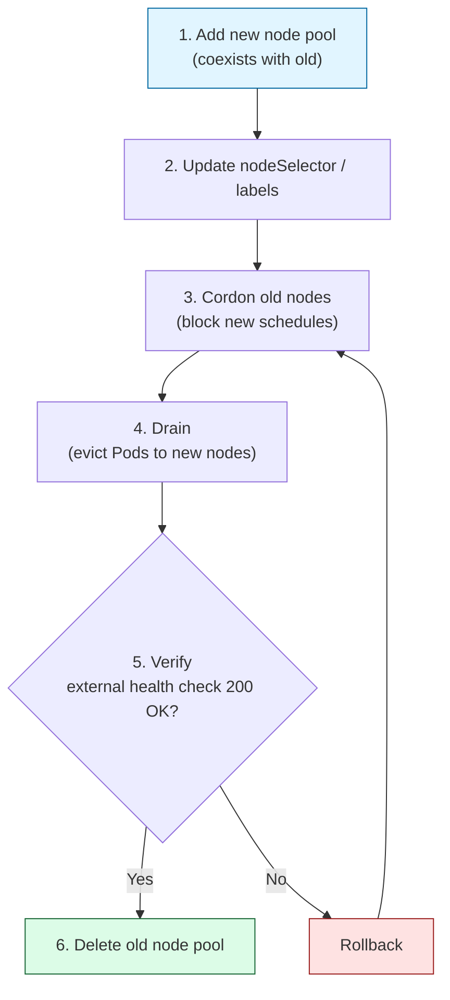

> **Timeline** · First half of 2026  
> **Environment** · AWS EKS 1.35 / Azure AKS 1.35  
> **Pricing basis** · USD (2026 Q1–Q2)

## TL;DR

A small production Kubernetes setup (EKS + AKS, about 10 apps, $510/mo) was trimmed by **$200/mo, $2,400/yr (39%)** through incremental optimization during normal operations.

The wins came from six patterns:

1. **Downsizing over-provisioned nodes** (4 vCPU → 2 vCPU)
2. **Ingress consolidation** (4 ALBs → 1, via IngressGroup)
3. **Right-sizing CPU/Memory requests** based on measured p95
4. **Tuning the monitoring stack** (Loki mode switch, Tempo retention, Prometheus PVC)
5. **Disabling unused managed add-ons + aligning alert thresholds**
6. **Nightly/weekend stop schedule for the AKS dev cluster** (active only weekdays 08:00–20:00, ~$214/mo additional savings)

All production optimizations done **with zero downtime**. Grafana dashboards, alert rules, and PVCs were all preserved.

## Environment Profile

| Cluster | Nodes | Role | App count | Ingress |
|---|---|---|---|---|
| **AWS EKS 1.35** (ap-northeast-2) | `t3.large` × 1 (ops) | monitoring/platform | - | 1 ALB (IngressGroup-merged) |
| | `t3.large` × 1 (api) | app hosting | 4 | |
| **Azure AKS 1.35** (koreacentral) | `B2ms` × 1 (ops) | monitoring/platform | - | NGINX Ingress × 1 |
| | `B2ms` × 1 (api) | app hosting | 6 | |

Both clusters run single-replica production workloads. Traffic is modest, but availability must hold. A common small-SaaS setup.

## Why Small Clusters Are *More* Inefficient

The smaller the cluster, the larger the share of fixed cost. Pre-optimization breakdown:

| Item | Share |
|------|-------|
| Control planes (EKS $73 + AKS $0) | 14% |
| Nodes (EKS 4× $160 + AKS 2× $240) | 78% |
| Load balancers (4 ALBs) | 8% |

In a small footprint, a single oversized node wastes 10–20% of the bill. On the upside, **ROI is high**: a few hours of tuning often yields 10–40% savings.

## The Six Waste Patterns

### 1. Over-Provisioned Nodes

#### Before
- AKS: `Standard_B4ms (4 vCPU / 16 GiB) × 2`, overkill for 6 apps
- EKS: `t3.large × 4` (spread across 2 clusters, pre-consolidation)

#### After
- AKS: `Standard_B2ms (2 vCPU / 8 GiB) × 2` (ops + api split)
- EKS: `t3.large × 2` in a single cluster (ops + api split)

#### Three Gotchas

Node resizing looks trivial, but a few things need checking first.

**1. PV zone compatibility.** `gp2`/`gp3` EBS volumes are AZ-locked. If a new node lands in a different AZ, Pods stall on `FailedScheduling`. Check `topology.kubernetes.io/zone` on existing PVs *before* creating the new node pool.

**2. AKS minor-version stepping.** AKS does not allow skipping minor versions. 1.32 → 1.35 means stepping `1.32 → 1.33 → 1.34 → 1.35`. Each hop takes 10–20 minutes, so the control-plane alone runs about an hour end to end. Node-pool rollover is on top of that. (EKS enforces the same N+1 rule, but it was AKS where the stepping actually slowed us down on this migration.)

```bash
# Upgrade the control plane step by step
az aks upgrade --resource-group <rg> --name <cluster> \
  --kubernetes-version 1.33.0 --control-plane-only --yes
# repeat the same for 1.34, 1.35
```

**3. AKS System pool constraint.** AKS requires at least one System-mode pool. Deleting the existing System pool means promoting another pool first.

```bash
# Create the new api pool as System (it holds the app workloads)
az aks nodepool add ... --name api --mode System --labels role=api

# To delete the old unified (System) pool, temporarily promote ops
az aks nodepool update ... --name ops --mode System
az aks nodepool delete ... --name unified --no-wait
az aks nodepool update ... --name ops --mode User
```

#### Savings
- AKS: $240/mo → $120/mo (**−$120**)
- EKS: $160/mo → $80/mo after consolidation (**−$80**)

---

### 2. Ingress / Load Balancer Consolidation

#### Before
EKS had one ALB per app group. 4 ALBs × $18/mo = **$72/mo**.

#### After
The AWS Load Balancer Controller's **IngressGroup** annotation merges Ingress resources into a single ALB:

```yaml
apiVersion: networking.k8s.io/v1
kind: Ingress
metadata:
  annotations:
    alb.ingress.kubernetes.io/group.name: prod-shared
    alb.ingress.kubernetes.io/scheme: internet-facing
    alb.ingress.kubernetes.io/listen-ports: '[{"HTTPS":443}]'
    alb.ingress.kubernetes.io/ssl-redirect: '443'
```

Ingress resources sharing the same `group.name` merge onto one ALB, with host/port-based routing handling all four apps.

AKS was already on a single NGINX Ingress Controller LB, so no change.

#### Savings
$54/mo (3 ALBs removed).

---

### 3. Request Right-Sizing

This step starts from measurement. Pull 30–60 days of `container_cpu_usage_seconds_total` and `container_memory_working_set_bytes` at p95/p99 from Prometheus, and the over-requesting becomes clear.

Real patterns we found:

| App | Request (Before) | p95 actual | Request (After) | Note |
|----|------------------|-----------|-----------------|------|
| Spring Boot API | CPU 1000m / MEM 2Gi | 120m / 900Mi | CPU 300m / MEM 1.5Gi | |
| Flask analysis | CPU 500m / MEM 1Gi | 30m / 200Mi | CPU 100m / MEM 512Mi | |
| ArgoCD repo-server | CPU 500m / MEM 512Mi | 20m / 400Mi | CPU 100m / MEM 768Mi | MEM raised (OOM) |

**Consider dropping CPU limits** as well. CFS throttling is a frequent source of latency, and on small clusters a well-sized CPU *request* alone is usually enough to avoid overcommit. (Multi-tenant shared clusters need a different rule.)

#### Savings
Not a direct line-item cut. The actual gain is **one less node**. After right-sizing, all 6 apps fit on a single api node at 61% MEM utilization.

---

### 4. Monitoring Stack Tuning

On small clusters, the monitoring stack often consumes more resources than the workloads it observes.

**Loki: SimpleScalable → SingleBinary**

SimpleScalable splits read/write/backend into 5–6 pods minimum. For a measured load of 27m CPU / 207Mi, SingleBinary is much lighter.

```yaml
deploymentMode: SingleBinary
singleBinary:
  replicas: 1
  persistence:
    size: 10Gi
```

**Tempo retention: 30d → 7d**

Tempo kept OOM-ing. Root cause: 30 days of trace index held in memory. Dropping to 7d eliminated OOMs and reduced S3 spend.

**Prometheus PVC: 40Gi → 30Gi, retention 60d → 90d**

60-day actual usage was 9.5 GB. Projected 90-day usage was about 14 GB, so we increased retention while decreasing the PVC size.

#### Savings
Direct savings are small ($10/mo), but the reclaimed node capacity is what made the api node downsize safe.

---

### 5. Managed Add-ons + Alert Threshold Alignment

#### Unused managed add-ons (AKS)

AKS ships a handful of opt-out add-ons. If you don't use them, turn them off:

- Azure Policy for AKS
- Image Cleaner (Eraser)
- Microsoft Defender for Containers (if you use a separate tool)

Each adds pods that consume 10–50m CPU in `kube-system`. The impact is noticeable at small scale.

#### Alert thresholds that match reality

Misaligned alerts drown teams in noise. Examples we corrected:

- **Node Disk Pressure**: 80% → 85% (kubelet's image GC default is 85%; alerting at 80% fires before GC even runs)
- **JVM Heap**: 85% → 90% (G1GC runs Major GC around 85%, triggering transient spikes)
- **JVM GC Pause**: 1s → 2s

Lower alert noise reduces on-call fatigue, which in turn improves the detection time for actual incidents. This is not a direct dollar savings but it is an operational cost reduction.

---

### 6. Nightly/Weekend Stop Schedule for the AKS Dev Cluster

A cluster used purely for development and verification has no reason to run 24/7. We applied a schedule that stops the entire AKS cluster outside business hours (weekdays 08:00–20:00 KST).

Two PowerShell runbooks (Start/Stop) were added to an Azure Automation account, then linked to the same schedules (`Daily-Start-8AM-KST`, `Daily-Stop-8PM-KST`) already used for the Bastion Jump Host.

```powershell
# Stop-AKSCluster.ps1 (Start-AKSCluster.ps1 follows the same shape)
$kstNow = [System.TimeZoneInfo]::ConvertTimeBySystemTimeZoneId(
    [DateTime]::UtcNow, "Korea Standard Time")

if ($kstNow.DayOfWeek -eq "Saturday" -or $kstNow.DayOfWeek -eq "Sunday") {
    Write-Output "Weekend - skipping."; return
}

Connect-AzAccount -Identity | Out-Null
$cluster = Get-AzAksCluster -ResourceGroupName "<resource-group>" -Name "<cluster-name>"

if ($cluster.PowerState.Code -ne "Stopped") {
    Stop-AzAksCluster -ResourceGroupName "<resource-group>" -Name "<cluster-name>"
}
```

The weekend check is done inside the script using KST. Authentication uses the Automation account's System Assigned Managed Identity, so no separate credential handling is required.

The result is that uptime drops from 168 hours/week to 60 hours/week (about 36%).

**Recovery flow after restart** (about 5–10 minutes)

1. `Start-AzAksCluster` → control plane comes up (~3 min)
2. kubelet reconnects to the CP from the nodes
3. Pods restart automatically based on stored Deployment specs (no manual deploy)
4. Pods become Ready → DB/service reconnects → traffic resumes

Kubernetes resource definitions (etcd) and PV data (Azure Disk) remain intact while the cluster is stopped. Metrics and logs simply show a gap during the stop window — that is collection downtime, not data loss. Transient Pod Not Ready alerts on startup are suppressed using a Grafana Mute Timing.

#### Savings

| Item | 24/7 | With schedule (36% uptime) | Savings |
|------|------|---------------------------|---------|
| Control plane (Standard tier) | $72/mo | ~$28/mo | **$44/mo** |
| Nodes (B2ms × 2) | ~$280/mo | ~$110/mo | **$170/mo** |
| **Total** | **~$352/mo** | **~$138/mo** | **~$214/mo** |

---

## Zero-Downtime Execution Patterns

Live migrations follow a few repeatable patterns. The ones used in this work are below.

### Pattern 1: Scale Up → Update → Scale Down

Spin up new nodes/PVs/deployments first, and only tear down old resources after Pod movement is confirmed.



### Pattern 2: Single-Replica Rolling Updates

For single-replica apps, default `maxSurge: 25% / maxUnavailable: 25%` is meaningless. Be explicit:

```yaml
strategy:
  type: RollingUpdate
  rollingUpdate:
    maxSurge: 1        # new Pod comes up first
    maxUnavailable: 0  # old Pod leaves only after new Pod is Ready
```

With enough node headroom, single-replica rollouts can run with no downtime.

### Pattern 3: Pre-Drain Checklist

```bash
# 1. Any stateful pods on this node?
kubectl get pods -A -o wide --field-selector spec.nodeName=<node>

# 2. PV zone compatibility
kubectl get pvc -A -o json | jq '.items[] | {pvc: .metadata.name, sc: .spec.storageClassName}'

# 3. PDBs (a bad PDB can block drain forever)
kubectl get pdb -A

# 4. DaemonSets require the flag
kubectl drain <node> --ignore-daemonsets --delete-emptydir-data
```

### Pattern 4: Lossless Grafana Migration

Monitoring migrations most often break in three places:

1. **ConfigMap-backed dashboards**: Grafana dashboard JSON as `ConfigMap` + sidecar survives Helm reinstalls.
2. **Unified Alerting + provisioning**: alert rules as YAML in Git (`provisioning/alerting/`).
3. **Pre-work full backup**: export all dashboards/rules via `grafana-api` or `grizzly` before any big change.

We redeployed the full stack twice during this work. All 38 alert rules and dashboards survived both times.

---

## Results: Before & After

| Item | Before | After | Savings |
|---|---:|---:|---:|
| AKS nodes (B4ms×2 → B2ms×2) | $240 | $120 | −$120 |
| EKS nodes (consolidated) | $160 | $80 | −$80 |
| EKS ALBs (4 → 1) | $72 | $18 | −$54 |
| AKS add-ons | $10 | $0 | −$10 |
| Misc resource tuning | $28 | $22 | −$6 |
| **Monthly total** | **$510** | **$310** | **−$200** |
| **Annual total** | **$6,120** | **$3,720** | **−$2,400** |

**39% reduction** (production cluster baseline).

Pattern 6 (dev cluster stop schedule) reduces an additional **~$214/mo** from a separate ~$352/mo baseline. Combined across both clusters: ~$414/mo, ~$5,000/yr.

**Qualitative wins**
- Zero downtime (external health check: 0 interruptions)
- Reduced alert noise → less on-call fatigue
- Longer observation window (Prometheus 60d → 90d) at lower cost
- Simpler architecture (ALB 4 → 1, unified node pool structure)

## A Practical Checklist

Before you start, run these against your own cluster.

### Resource Audit

```bash
# 1. Actual node utilization
kubectl top nodes

# 2. Per-pod actual vs request
kubectl top pods -A --sort-by=cpu
kubectl top pods -A --sort-by=memory

# 3. Find apps where requests are ≥5× the p95 actual (needs Prometheus)
```

### Waste-Pattern Audit

- [ ] Node average CPU utilization under 30%? → downsize candidate
- [ ] Multiple ALBs/LBs per app? → consolidation candidate
- [ ] Unused managed add-ons in `kube-system`? → disable
- [ ] Monitoring stack eating >30% of cluster resources? → tune
- [ ] More than 10 alerts/day? → threshold review
- [ ] Dev/staging cluster running 24/7? → stop schedule candidate

### Zero-Downtime Checklist

- [ ] Existing PV zones checked (`topology.kubernetes.io/zone`)
- [ ] PDBs reviewed (drain blockers)
- [ ] Single-replica apps: `maxSurge: 1 / maxUnavailable: 0`
- [ ] Monitoring stack full backup (dashboards + alert rules)
- [ ] External health check running (1 s interval curl during work)
- [ ] Rollback plan (especially before node pool deletion)

---

## Six Lessons

1. **Defaults hurt small clusters more.** Cloud vendor defaults assume scale. On a small cluster, "default" often means "overprovisioned."

2. **Managed isn't free.** Managed add-ons consume resources. Review their usage periodically.

3. **Right-sizing requires measurement.** A single `kubectl top` snapshot will OOM your nightly batch. Two or more weeks of p95/p99 data is the minimum.

4. **Align alerts with kubelet behavior.** kubelet GC, JVM GC, storage GC: if alert thresholds do not match these layers' built-in behavior, false positives become routine.

5. **"Scale up before scale down."** Most of the zero-downtime work comes down to this single rule. Old resources are removed only after the new ones are confirmed.

6. **Non-production doesn't mean free.** Dev and staging clusters slip through cost reviews because "it's not production." A dev cluster running 24/7 burns a real budget. If it sits idle for 64% of the week, stop it during those hours.

---

## Closing Thoughts

The absolute dollar figure ($2,400/yr) matters less than the structural result: **40% of fixed cluster cost was recoverable**. Applying the same patterns to a larger cluster scales the absolute savings proportionally.

Small-cluster optimization does not require an enterprise FinOps program. It can be done incrementally during normal operations, without dedicated tooling or a large team. The checklist above is enough to start with.