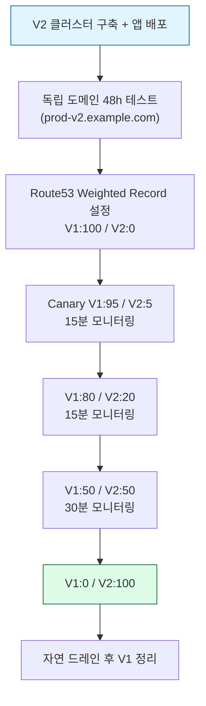

> **작업 시점** · 2026년 1분기  
> **환경** · AWS EKS 1.32/1.33 → 1.35, AL2 → AL2023  
> **통화 기준** · USD (2026 Q1)

## ~49% 절감 요약

[지난 글](/ko/blog/k8s-small-cluster-cost-optimization/)이 운영 중인 소규모 클러스터를 단계적으로 조정한 기록이라면, 이번 글은 누적된 인프라 부채를 끊기 위해 V1을 폐기하고 V2를 새로 짓는 길을 택한 기록입니다.

| | V1 (Before) | V2 (After) | 절감 |
|---|---:|---:|---:|
| 운영 환경 | $5,114/월 | $2,295/월 | −$2,819 (55%) |
| 개발 환경 | $1,483/월 | $1,063/월 | −$420 (28%) |
| **합산** | **~$6,598/월** | **~$3,358/월** | **~−$3,240/월 (~49%)** |

연 환산 ~$38,880 절감입니다. 다음 7가지 패턴으로 정리됩니다.

1. **V2 클러스터 신규 구축으로 누적 부채 청산** (EKS 1.32/1.33 → 1.35, ArgoCD v1 → v3, Kafka Zookeeper → KRaft 등)
2. **노드 그룹 구조 단순화** (PROD 9개 그룹 25노드 → 5개 그룹 15노드)
3. **STG 환경 V2 제외** (옮기지 않음의 결정)
4. **nodeSelector 정책 강제 + kube-system 컨트롤러 ops 통합**
5. **Mimir 28일 데이터 기반 라이트사이징** (Kafka, ops 노드 다운사이즈)
6. **관측성 카디널리티 제어** (Mimir 시리즈 60% 감소)
7. **Route53 Weighted Routing 무중단 전환**

전환 작업은 외부 헬스체크 기준으로 **완전 무중단**으로 진행했습니다.

## 환경 프로파일

### V1 (마이그레이션 이전)

| 클러스터 | EKS | 노드 수 | 노드 그룹 | 인스턴스 구성 |
|---|---|---|---|---|
| PROD | 1.32 (AL2) | 25 | 9개 | m6i.xlarge × 16, m6i.2xlarge × 3, m7i.xlarge × 5, 그 외 1 |
| DEV | 1.33 (AL2) | 9 | 3개 | t3.xlarge × 5, m6i.xlarge × 4 |

### V2 (마이그레이션 이후)

| 클러스터 | EKS | 노드 수 | 노드 그룹 | 인스턴스 구성 |
|---|---|---|---|---|
| PROD | 1.35 (AL2023) | 15 | 5개 | m6i.xlarge × 9 (backend/kafka/tenant), m6i.large × 4 (vendor), t3.xlarge × 2 (ops) |
| DEV | 1.35 (AL2023) | 10 | 4개 | t3.large × 3 (ops), t3.xlarge × 4 (backend·vendor), t3.large × 3 (kafka) |

운영 환경은 ArgoCD 60여 개 앱, Helm 릴리스 10여 개, Kafka 3 브로커 + 3 컨트롤러(KRaft), 다중 노드 Valkey 클러스터 등으로 구성됩니다.

## 왜 운영 중 다운사이즈만으로는 풀기 어려웠나

소규모 글에서 다룬 6가지 패턴은 모두 운영 중인 클러스터를 그대로 두고 인스턴스를 줄이거나 리소스를 라이트사이징하는 방식이었습니다. 이번 환경에서는 같은 접근으로는 닿을 수 없는 부채가 누적되어 있었습니다.

**버전 부채.** EKS 1.32에서 1.35까지는 4단계 마이너 점프가 필요합니다. EKS는 한 번에 한 마이너 버전만 업그레이드할 수 있고, 컨트롤 플레인 단계당 10~20분, 노드 풀 교체까지 합치면 한 단계당 1시간 이상 걸립니다. 여기에 ArgoCD v1 → v3(메이저 두 단계), Loki 2.x → 3.x, Grafana 10 → 12, Strimzi 0.46(KRaft only) 같은 메이저 점프가 동시에 필요했습니다.

**노드 그룹 부채.** PROD V1은 노드 그룹 9개에 인스턴스 4종(m6i.xlarge, m6i.2xlarge, m7i.xlarge, 그 외)이 혼재했습니다. 시기별로 다른 결정이 누적된 결과였고, 라이트사이징을 위해 정렬부터 다시 해야 하는 상태였습니다.

**데이터 백엔드 부채.** Redis 7.x를 Valkey 8.x로 전환하고, Kafka를 Zookeeper 모드에서 KRaft로 옮겨야 했습니다. 클러스터를 그대로 두고 진행하면 데이터 마이그레이션과 운영 모드 전환을 같은 클러스터 안에서 수행해야 했고, 롤백 단위가 너무 컸습니다.

새 클러스터를 짓고 트래픽만 옮기는 방식이 결과적으로 가장 안전했습니다.

## 7가지 패턴

### 1. V2 클러스터 신규 구축으로 누적 부채 청산

기존 클러스터는 그대로 두고 V2 클러스터를 별도로 구축한 뒤, 한 번에 다음 항목을 정리했습니다.

| 항목 | V1 | V2 |
|---|---|---|
| EKS | 1.32 / 1.33 | 1.35 |
| 노드 AMI | Amazon Linux 2 | AL2023 |
| Secret Encryption | 미사용 | KMS 활성화 |
| ArgoCD | v1.x | v3.2.x |
| Argo Rollouts | v1.8.x | v1.8.x |
| Loki | 2.x (단일) | 3.6.x (SimpleScalable + S3) |
| Grafana | 10.x | 12.x |
| OpenSearch | 2.x | 3.x |
| Kafka | Zookeeper 모드 | KRaft 모드 (Strimzi 0.46) |
| Redis / Valkey | Redis 7.x | Valkey 8.x |
| AWS LB Controller | v2.x | v3.0.x |
| Cluster Autoscaler | v1.x | v1.35.x |

EKS와 ArgoCD 메이저 버전은 클러스터 안에서 단계별로 올리기보다 새 클러스터에 한 번에 정리하는 편이 위험과 시간 모두에서 유리했습니다. 특히 Strimzi 0.46이 KRaft 전용이기 때문에 Kafka 마이그레이션은 새 클러스터를 만드는 시점이 사실상 자연스러운 분기점이었습니다.

### 2. 노드 그룹 구조 단순화

가장 큰 금액 절감이 발생한 패턴입니다.

#### Before (PROD V1)

- 노드 25대, 노드 그룹 9개
- 인스턴스 4종(`m6i.xlarge × 16`, `m6i.2xlarge × 3`, `m7i.xlarge × 5`, 그 외 1) 혼재
- 시기별 추가가 누적되어 역할 라벨과 인스턴스 사양이 일치하지 않음

#### After (PROD V2)

- 노드 15대, 노드 그룹 5개
- 인스턴스 2종(`m6i.xlarge`, `m6i.large`) + ops `t3.xlarge`
- 역할별 명확한 분리

| 노드 그룹 역할 | 인스턴스 | 수 | 워크로드 |
|---|---|---:|---|
| `ops` | t3.xlarge | 2 | 모니터링, ArgoCD, Strimzi, Debezium, Kafka UI |
| `backend` | m6i.xlarge | 3 | 메인 API, 배치, 처리 엔진 |
| `backend-vendor` | m6i.large | 4 | 외부 솔루션 격리 워크로드 |
| `kafka` | m6i.xlarge | 3 | Kafka brokers/controllers (taint: `kafka=true:NoSchedule`) |
| `backend-tenant` | m6i.xlarge | 3 | 테넌트 분리 워크로드 |

외부 솔루션 격리 노드 그룹을 분리한 것은 비용보다 격리 목적이 컸지만, 인스턴스를 `m6i.large`로 낮출 수 있었기 때문에 결과적으로 비용도 줄었습니다. Kafka 노드 그룹은 KRaft 컨트롤러와 브로커가 다른 워크로드와 섞이지 않도록 taint를 걸었습니다.

#### 절감

PROD 청구서 기준으로 월 **~$5,114에서 ~$2,295로 줄었습니다**. 인스턴스 통일로 운영도 단순해졌습니다.

### 3. STG 환경 V2 제외

V1에는 STG 노드 그룹과 여러 STG 앱이 운영 중이었습니다. V2 마이그레이션 범위에서 STG를 통째로 제외하기로 결정했습니다.

근거는 다음과 같았습니다.

- 장기간 업데이트가 없어 DEV/PROD와 버전 차이가 큼
- 사용 빈도 대비 유지 비용 과다
- 테스트 신뢰성이 떨어져 의사결정에 활용되지 못하는 상태

V2에서는 우선 제외하고, 향후 필요한 시점에 별도로 재구성하기로 했습니다. **"무엇을 옮기지 않을지"의 결정도 절감 패턴**입니다. 옮기지 않은 노드 그룹은 V1 클러스터 정리 시점에 함께 사라집니다.

### 4. nodeSelector 정책 강제 + kube-system 컨트롤러 ops 통합

노드 그룹을 5개로 분리한 뒤, 모든 워크로드에 `nodeSelector`를 명시했습니다.

- 5개 노드 그룹 각각에 `role` 라벨 부여 (`ops`, `backend`, `backend-vendor`, `kafka`, `backend-tenant`)
- 모든 Helm values, ArgoCD 매니페스트, kubectl patch에 `nodeSelector` 명시
- 전체 파드 100% 준수

여기에 더해 `kube-system`의 컨트롤러를 ops 노드로 일괄 이동했습니다.

| 컴포넌트 | 이전 위치 | 이동 방법 |
|---|---|---|
| AWS Load Balancer Controller | 분산 | Helm `nodeSelector` |
| Cluster Autoscaler | 분산 | Helm `nodeSelector` |
| EBS CSI Controller | 분산 | EKS Add-on `configurationValues` + SA 어노테이션 |
| EFS CSI Controller | 분산 | EKS Add-on `configurationValues` + 리소스 축소 |
| opensearch-exporter | 분산 | `--set nodeSelector.role=ops` |
| prometheus-operator, kube-state-metrics | 분산 | Helm values |
| Strimzi Operator, Debezium, Kafka UI | kafka 노드 | `helm upgrade` / `kubectl patch` |

`coredns`와 `metrics-server`는 의도적으로 분산 배치를 유지했습니다(DNS 가용성, 모든 노드 메트릭 수집).

#### EKS Add-on의 nodeSelector 적용 함정

EBS CSI Controller를 EKS Add-on으로 관리하면서 `configurationValues`로 `nodeSelector`만 추가하면 새 Pod에 IRSA 환경 변수(`AWS_ROLE_ARN`, `aws-iam-token` projected volume)가 주입되지 않아 `ec2:DescribeAvailabilityZones` 403 에러가 발생합니다.

```bash
kubectl annotate sa ebs-csi-controller-sa -n kube-system \
  eks.amazonaws.com/role-arn=arn:aws:iam::<ACCOUNT>:role/<EKS_EBS_ROLE> --overwrite
kubectl delete pod -n kube-system -l app=ebs-csi-controller
```

ServiceAccount에 `eks.amazonaws.com/role-arn` 어노테이션을 직접 추가하고 Pod를 재생성해야 합니다. EFS CSI Controller도 동일한 패턴입니다.

#### 효과

청구서에 직접 반영되는 금액은 작지만, 다음 두 패턴(라이트사이징, 카디널리티 제어)을 안전하게 진행할 수 있는 전제가 됩니다. 워크로드가 어디 떠 있는지 예측 가능해야 노드 다운사이즈가 가능합니다.

### 5. Mimir 28일 데이터 기반 라이트사이징

라이트사이징은 실측 없이 진행하지 않습니다. Mimir에서 28일치 메트릭을 추출해 다음과 같이 분석했습니다.

#### Kafka 노드: t3.xlarge × 3 → t3.large × 3

기존 분석에서 Kafka 노드는 "현행 유지" 판정을 받았습니다. 이유는 2a AZ Kafka 노드의 메모리 요청 합계 9.7Gi가 t3.large allocatable 6.9Gi를 초과한다는 점이었습니다.

원인을 분해해 보니 broker의 과다 설정(MEM 6Gi)과 비-Kafka 워크로드(Strimzi operator, Debezium, Kafka UI)가 같은 노드에 합산된 결과였습니다.

| 구성 요소 | CPU req | MEM req | 실 사용 |
|---|---|---|---|
| broker | 1,000m | 6,144Mi | ~1,500Mi |
| controller | 200m | 1,024Mi | ~300Mi |
| Strimzi operator | 200m | 256Mi | (ops 이동 가능) |
| Debezium | 500m | 1,024Mi | (ops 이동 가능) |
| Kafka UI | 100m | 256Mi | (ops 이동 가능) |

- broker MEM 6Gi → 4Gi (실 사용 1.5Gi 기반)
- `MaxDirectMemorySize` 3g → 1g (DEV 트래픽에서는 1g로 충분)
- 비-Kafka 워크로드를 ops 노드로 이동 (패턴 4)

JVM 합계: Heap 1,280Mi + DirectMemory 1,024Mi + Metaspace ~300Mi = ~2.6Gi. 4Gi 안에서 안전합니다.

bin packing 검증 결과 일반 노드 79%/79%, anti-affinity가 깨져 controller 2개가 한 노드에 몰리는 최악의 경우 90%/94%로 타이트하지만 수용 가능했습니다.

KRaft 합의 프로토콜은 3노드가 최소 구성이라 노드 수 자체는 줄일 수 없습니다. 인스턴스 사이즈만 절반으로 줄였습니다.

#### ops 노드: t3.xlarge × 2 → t3.large × 3

ops 노드는 노드 수를 늘리면서 사이즈를 줄이는 방식으로 갔습니다. PVC가 AZ에 묶여 있기 때문에 새 노드 그룹의 AZ 분포가 중요했습니다.

| StatefulSet | PVC | AZ |
|---|---|---|
| opensearch-master-0 | 50Gi | 2a |
| mimir-ingester-0 | 10Gi | 2a |
| mimir-compactor-0 | 10Gi | 2a |
| loki-write-0 | 10Gi | 2a |
| loki-backend-0 | 10Gi | 2a |
| grafana | 10Gi | 2a |
| prometheus-0 | 60Gi | 2c |
| mimir-store-gateway-0 | 5Gi | 2c |
| tempo-0 | 10Gi | 2c |

eksctl로 2개 AZ subnet을 명시해 노드 그룹을 생성하면 1+2 또는 2+1 분포가 보장됩니다. 새 노드 3대(2a × 2 + 2c × 1)로 모든 PVC를 수용했습니다.

#### EFS CSI Controller 리소스 축소

EFS CSI Controller는 동적 프로비저닝 API만 담당하고 실제 NFS mount는 node DaemonSet이 처리하기 때문에 리소스를 크게 줄여도 안전합니다.

- 요청: CPU 100m → 50m, MEM 256Mi → 64Mi
- 제한: CPU 200m, MEM 256Mi

#### 고아 PVC 정리

Kafka broker 5 → 3 축소 시 남았던 PVC 2개(각 100Gi gp3)를 정리해 월 ~$16를 추가로 회수했습니다. PV Reclaim Policy가 `Delete`였기 때문에 EBS 볼륨도 함께 삭제됐습니다.

### 6. 관측성 카디널리티 제어

"Mimir Ingester 메모리 시리즈 과다" alert가 firing 상태로 진입한 것이 시작이었습니다.

#### 진단

DEV·PROD 모두 threshold 400K를 초과한 상태였습니다. 분해해 보면 다음과 같습니다.

| 출처 | 시리즈 수 |
|---|---|
| kubelet | 67K ~ 86K |
| kube-apiserver histogram | ~28K |
| kafka partition metrics (PROD) | ~40K |
| 그 외 | 나머지 |

#### 조치

ServiceMonitor에 whitelist 방식의 `writeRelabelConfigs`를 적용해 실제 사용하는 메트릭만 ingest 하도록 제한했습니다.

```yaml
spec:
  endpoints:
    - port: http-metrics
      writeRelabelConfigs:
        - sourceLabels: [__name__]
          regex: '(metric_a|metric_b|metric_c|...)'
          action: keep
```

결과는 다음과 같습니다.

| 항목 | Before | After |
|---|---:|---:|
| 시리즈 수 (DEV) | ~400K 초과 | ~105K |
| 시리즈 수 (PROD) | ~400K 초과 | ~170K |
| `max_global_series_per_user` | 500K | 600K |
| Ingester 메모리 | 1,550Mi (limit 2Gi) | ~900Mi |

시리즈 수는 평균 60% 감소했고, alert threshold도 400K에서 480K(600K의 80%)로 조정해 동기화했습니다. Ingester 메모리는 limit 변경 없이도 안정 구간으로 들어왔습니다.

부수적으로 OpenSearch ISM(Index State Management) retention을 30일로 통일해 인덱스 비용도 정리했습니다.

### 7. Route53 Weighted Routing 무중단 전환

V2 클러스터를 새로 짓는 방식의 가장 큰 이점은 트래픽 단위로 점진적 전환이 가능하다는 점입니다.

#### 전환 절차 (PROD)



각 단계에서 error rate와 latency를 확인하고 문제가 있으면 weight 변경(수 초)으로 즉시 롤백합니다.

#### DEV 환경의 인증서 처리

DEV는 V1과 V2가 같은 도메인을 공유해야 했습니다. V1 ALB에 V2 인증서를 추가해 multi-cert 구성으로 운영했습니다.

```bash
aws elbv2 add-listener-certificates \
  --listener-arn <V1_HTTPS_LISTENER_ARN> \
  --certificates CertificateArn=arn:aws:acm:<REGION>:<ACCOUNT>:certificate/<V2_CERT_ID>
```

#### TTL 60초 + 자연 드레인

Route53 record의 TTL을 60초로 두고, 클라이언트별로 자연 드레인을 기다립니다.

| 클라이언트 | 예상 드레인 시간 |
|---|---|
| 웹 브라우저 | 5 ~ 15분 |
| 모바일 앱 | 10 ~ 30분 |
| API 클라이언트 | 5 ~ 10분 |
| 장기 실행 워커 | 30 ~ 60분 |

장시간 실행되는 워커 계열은 Keep-Alive와 connection pool 재사용 때문에 가장 오래 걸리므로 별도 모니터링이 필요합니다.

#### Debezium Dual Capture

전환 기간 동안 V1과 V2의 Debezium이 같은 binlog를 동시에 캡처합니다. 이중 처리를 막기 위해 Consumer 측에 idempotency key를 적용했습니다.

```
Shared DB (RDS)
        │ binlog
  ┌─────┴─────┐
  ↓           ↓
V1 Debezium  V2 Debezium → 같은 이벤트가 양쪽 Kafka에 발행됨
  ↓           ↓
V1 Consumer  V2 Consumer → idempotency key 확인 → 처리됐으면 skip
```

idempotency key는 테이블 PK 또는 PK + op + ts_ms로 구성하고, 처리된 이벤트 추적은 공유 DB에 저장합니다. Consumer 로직 변경이 필요해 개발팀과의 협업이 전제됩니다.

#### 결과

PROD 60여 개 ArgoCD 앱이 V2에서 정상 동작하는 것을 확인한 후 트래픽 100% 전환에 도달했습니다. 외부 헬스체크 기준 중단 0이었습니다.

## 결과: Before & After

| 항목 | V1 (Before) | V2 (After) | 절감 |
|---|---:|---:|---:|
| PROD 노드 (그룹 9 → 5, 25 → 15노드) | $5,114 | $2,295 | −$2,819 (55%) |
| DEV 노드 (그룹 3 → 4, 9 → 10노드, 라이트사이징 적용) | $1,483 | $1,063 | −$420 (28%) |
| **합계 (월)** | **$6,598** | **$3,358** | **−$3,240 (~49%)** |
| **합계 (연)** | **$79,176** | **$40,296** | **−$38,880** |

비용 외 효과는 다음과 같았습니다.

- **운영 단순화**: PROD 인스턴스 4종 → 2종, 노드 그룹 9개 → 5개
- **버전 부채 청산**: EKS 1.32 → 1.35, ArgoCD v1 → v3, Loki 2 → 3, Grafana 10 → 12 일괄 정리
- **데이터 백엔드 모더나이즈**: Redis → Valkey, Kafka Zookeeper → KRaft
- **관측성 안정화**: Mimir 시리즈 60% 감소, alert 안정 구간 진입
- **무중단 유지**: Route53 weight 단위로 전환, 외부 헬스체크 기준 중단 0
- **보안 강화**: KMS Secret Encryption 활성화, IRSA / Pod Identity 정리

## 실전 체크리스트

### 신규 클러스터 구축 전

- [ ] 메이저 점프가 필요한 컴포넌트 목록화 (EKS, ArgoCD, Loki, Grafana 등)
- [ ] 데이터 백엔드 마이그레이션 필요 여부 확인 (Redis → Valkey, Kafka 모드 등)
- [ ] 노드 그룹을 처음부터 역할별로 설계 (`role` 라벨, taint, 인스턴스 종류 통일)
- [ ] 옮기지 않을 환경(STG 등) 결정과 사유 문서화

### 노드 라이트사이징 전

- [ ] 최소 28일치 실측 데이터 확보 (Mimir, Prometheus 등)
- [ ] PVC의 AZ 분포 확인 (`topology.kubernetes.io/zone`)
- [ ] eksctl 노드 그룹 생성 시 subnet AZ 명시
- [ ] bin packing 시뮬레이션 (anti-affinity가 깨졌을 때 최악 케이스 포함)
- [ ] KRaft, etcd 같은 합의 프로토콜의 노드 수 최소 요건 확인

### nodeSelector 적용 시

- [ ] EKS Add-on `configurationValues`로 nodeSelector 추가 시 IRSA 어노테이션 확인
- [ ] ArgoCD 동기화에서 `kubectl patch`로 직접 추가된 affinity 잔존 여부 확인
- [ ] DaemonSet toleration은 `--type=json`으로 추가 (strategic merge는 기존 값 교체 가능)

### 무중단 전환 전

- [ ] 독립 도메인 테스트 48시간 이상
- [ ] V1 ALB에 V2 인증서 추가 (DEV 같은 동일 도메인 공유 시)
- [ ] Route53 TTL 60초 설정
- [ ] Debezium dual capture 구간의 Consumer idempotency key 합의
- [ ] 즉시 롤백 절차 검증 (weight 변경 명령어 사전 준비)

## 이번 작업에서 얻은 교훈 7가지

1. **메이저 부채는 한 번에 끊는 편이 안전합니다.** EKS 마이너 5단계 점프와 ArgoCD v1 → v3, Kafka 모드 전환을 같은 클러스터 안에서 순차 진행하는 것보다 새 클러스터에서 한 번에 정리하는 편이 위험과 시간 모두에서 유리했습니다.

2. **노드 그룹 부채는 인스턴스 종류부터 통일합니다.** 시기별로 추가된 인스턴스 4종 혼재 상태에서는 라이트사이징이 시작되지 않습니다. 종류를 줄이고 역할을 명확히 한 뒤에야 다운사이즈 결정이 가능했습니다.

3. **옮기지 않는 결정도 절감입니다.** STG 환경처럼 사용 빈도가 낮고 관리되지 않는 환경은 V2 범위에서 제외하는 편이 운영 부담을 줄입니다.

4. **nodeSelector 정책은 라이트사이징의 전제입니다.** 워크로드가 어디에 떠 있는지 예측 가능해야 노드를 줄일 수 있습니다. EKS Add-on의 `configurationValues` 사용 시 IRSA 어노테이션 누락 같은 함정은 사전에 확인해야 합니다.

5. **실측 없는 라이트사이징은 위험합니다.** broker MEM 6Gi가 과한지 적절한지는 실 사용 1.5Gi라는 실측이 있을 때만 판단됩니다. JVM 메모리 산출도 Heap, DirectMemory, Metaspace를 분해해 검증해야 합니다.

6. **관측성도 비용입니다.** 시리즈 카디널리티가 늘어나면 메모리, S3, 쿼리 비용이 동시에 증가합니다. ServiceMonitor 단계에서 whitelist 방식으로 통제하면 사후 감축보다 효과가 큽니다.

7. **무중단의 단위가 바뀝니다.** 소규모 클러스터에서는 `maxSurge: 1 / maxUnavailable: 0`으로 Pod 단위 무중단을 만들지만, 대규모에서는 Route53 weight 단위로 트래픽 자체를 점진 전환합니다. Debezium dual capture와 Consumer idempotency 같은 데이터 정합성 장치도 함께 필요합니다.

## 마치며

소규모 글이 운영 중 다운사이즈와 통합으로 ~48%를 줄인 기록이라면, 이번 글은 누적된 인프라 부채를 끊기 위해 V1을 폐기하고 V2를 새로 짓는 길로 ~49%를 줄인 기록입니다.

야간 종료, 단일 ALB 통합, Loki SingleBinary 같은 소규모 패턴은 이 규모에서는 성립하지 않습니다. 대신 V1 폐기, 노드 그룹 단순화, Mimir 카디널리티 제어, Route53 Weighted Routing 같은 다른 차원의 패턴이 자리를 차지합니다.

규모와 무관하게 같은 원칙은 남습니다. **실측 데이터 없이 라이트사이징하지 않고, 새 자원이 정상 확인된 이후에만 기존 자원을 제거하며, 옮기지 않을 것을 결정하는 작업도 함께 수행한다**는 점입니다.
