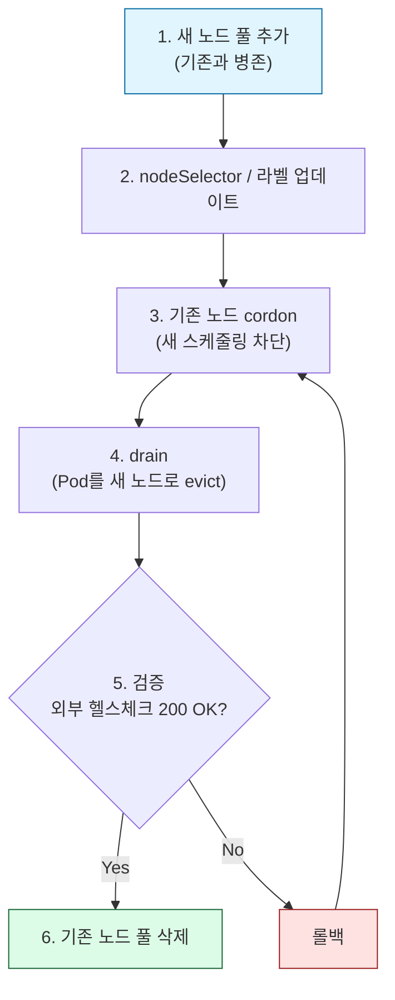

> **작업 시점** · 2026년 상반기  
> **환경** · AWS EKS 1.35 / Azure AKS 1.35  
> **통화 기준** · USD (2026 Q1–Q2)

## 39% 절감 요약

EKS와 AKS에서 앱 10개 남짓을 운영하던 소규모 프로덕션 클러스터가 있었습니다. 운영 중 단계적으로 최적화를 진행한 결과 월 운영비가 **$510에서 $310**으로 줄었습니다. 연 환산으로는 $2,400, 비율로는 39%에 해당합니다.

효과가 컸던 순서대로 정리하면 다음과 같습니다.

1. **과잉 프로비저닝된 노드 다운사이즈** (4vCPU → 2vCPU)
2. **Ingress 통합** (ALB 4개 → 1개, IngressGroup 활용)
3. **CPU/Memory request 라이트사이징** (실측 기반)
4. **모니터링 스택 튜닝** (Loki 배포 모드 전환, Tempo retention, Prometheus PVC)
5. **사용하지 않는 매니지드 애드온 정리 + 알림 임계값 조정**
6. **AKS Dev 클러스터 야간/주말 종료 스케줄** (평일 08:00–20:00만 가동, ~$214/월 추가 절감)

프로덕션 최적화 작업은 모두 **무중단**으로 진행했습니다. Grafana 대시보드, 알림 룰, PVC 모두 유지됐습니다.

## 환경 프로파일

| 클러스터 | 노드 | 역할 | 앱 수 | Ingress |
|---|---|---|---|---|
| **AWS EKS 1.35** (ap-northeast-2) | `t3.large` × 1 (ops) | 모니터링/플랫폼 | - | ALB × 1 (IngressGroup 통합) |
| | `t3.large` × 1 (api) | 앱 호스팅 | 4 | |
| **Azure AKS 1.35** (koreacentral) | `B2ms` × 1 (ops) | 모니터링/플랫폼 | - | NGINX Ingress × 1 |
| | `B2ms` × 1 (api) | 앱 호스팅 | 6 | |

두 클러스터 모두 단일 replica 기반으로 운영됩니다. 트래픽은 많지 않지만 다운타임은 허용되지 않는, 흔한 소규모 SaaS 운영 환경입니다.

## 왜 소규모 클러스터가 더 비효율적일까요?

클러스터 규모가 작을수록 **고정비 비중이 커집니다**. 작업 전 비용 구조를 살펴보면 다음과 같습니다.

| 항목 | 비중 |
|------|------|
| 컨트롤 플레인 (EKS $73 + AKS $0) | 14% |
| 노드 (EKS 4대 $160 + AKS 2대 $240) | 78% |
| 로드밸런서 (ALB 4개) | 8% |

규모가 작으면 노드 한 대만 오버스펙이어도 전체 비용의 10–20%가 새어 나갑니다. 이처럼 소규모 클러스터에서는 최적화 효과도 그만큼 크게 나타납니다. 몇 시간의 튜닝만으로 10–40%를 줄일 수 있는 경우도 적지 않습니다.

## 낭비 패턴 6가지

### 1. 과잉 프로비저닝된 노드

#### Before
- AKS: `Standard_B4ms (4vCPU/16GiB) × 2` (앱 6개를 운영하기에는 과한 스펙이었습니다)
- EKS: 통합 전 `t3.large × 4` (클러스터 2개에 분산).

#### After
- AKS: `Standard_B2ms (2vCPU/8GiB) × 2` (ops + api 분리)
- EKS: `t3.large × 2` (단일 클러스터로 통합 후 ops + api 분리)

#### 다운사이즈 전에 확인할 세 가지

단순한 작업처럼 보이지만 몇 가지 확인할 점이 있습니다.

**1. PV Zone 호환성**. gp2/gp3 EBS는 AZ에 묶여 있습니다. 새 노드가 기존 PV와 다른 AZ에 뜨면 Pod가 `FailedScheduling` 상태에서 멈춥니다. 노드 풀을 만들기 전에 `topology.kubernetes.io/zone` 라벨로 기존 PV의 AZ부터 확인해야 합니다.

**2. AKS 마이너 버전 단계 업그레이드**. AKS는 마이너 버전을 건너뛸 수 없습니다. 1.32 → 1.35라면 `1.32 → 1.33 → 1.34 → 1.35` 순서로 올라가야 하며, 단계당 10–20분이 걸리므로 컨트롤 플레인만 올려도 1시간 전후가 소요됩니다. 노드 풀 교체 시간은 별도입니다. (EKS도 동일한 N+1 제약이 있지만, 이번 이관에서 단계 업그레이드가 실제로 발목을 잡은 쪽은 AKS였습니다.)

```bash
# 컨트롤 플레인만 먼저 단계별로 업그레이드
az aks upgrade --resource-group <rg> --name <cluster> \
  --kubernetes-version 1.33.0 --control-plane-only --yes
# 1.34, 1.35도 같은 방식으로 진행
```

**3. System 풀 제약 (AKS)**. AKS는 System 풀이 최소 1개는 존재해야 합니다. 기존 System 풀을 삭제하려면 다른 풀을 먼저 System으로 승격시켜 두어야 합니다.

```bash
# 새 api 풀을 System 모드로 생성 (앱 워크로드가 올라가는 풀이므로 System이 적합)
az aks nodepool add ... --name api --mode System --labels role=api

# 기존 unified 풀(System) 삭제를 위해 ops를 임시로 System 승격
az aks nodepool update ... --name ops --mode System
az aks nodepool delete ... --name unified --no-wait
az aks nodepool update ... --name ops --mode User
```

#### 절감
- AKS: $240/월 → $120/월 (**$120 절감**)
- EKS: 단일 클러스터 통합으로 $160/월 → $80/월 (**$80 절감**)

---

### 2. Ingress/로드밸런서 통합

#### Before
EKS에는 앱 그룹마다 ALB가 따로 떠 있었습니다. ALB 4개 × $18/월 = **$72/월**.

#### After
AWS Load Balancer Controller의 **IngressGroup** 어노테이션으로 ALB 하나에 통합했습니다.

```yaml
apiVersion: networking.k8s.io/v1
kind: Ingress
metadata:
  annotations:
    alb.ingress.kubernetes.io/group.name: prod-shared
    alb.ingress.kubernetes.io/scheme: internet-facing
    alb.ingress.kubernetes.io/listen-ports: '[{"HTTPS":443}]'
    alb.ingress.kubernetes.io/ssl-redirect: '443'
```

동일한 `group.name`을 사용하는 Ingress 리소스는 ALB 하나로 병합됩니다. 호스트/포트 기반 라우팅으로 앱 4개가 ALB 한 대를 공유하는 구조입니다.

AKS는 이미 NGINX Ingress Controller에 LB 하나짜리 구성이라 변경이 필요하지 않았습니다.

#### 절감
ALB 3대 제거로 **$54/월**이 절감됩니다.

---

### 3. CPU/Memory Request 라이트사이징

라이트사이징은 실측 데이터 없이 진행해서는 안 됩니다. Prometheus에서 `container_cpu_usage_seconds_total`, `container_memory_working_set_bytes`를 30–60일치 p95/p99로 추출하면 request가 얼마나 과했는지 확인할 수 있습니다.

실제 측정 결과는 다음과 같았습니다.

| 앱 | request (Before) | p95 실측 | request (After) | 비고 |
|----|------------------|----------|-----------------|------|
| Spring Boot API | CPU 1000m / MEM 2Gi | 120m / 900Mi | CPU 300m / MEM 1.5Gi | |
| Flask analysis | CPU 500m / MEM 1Gi | 30m / 200Mi | CPU 100m / MEM 512Mi | |
| ArgoCD repo-server | CPU 500m / MEM 512Mi | 20m / 400Mi | CPU 100m / MEM 768Mi | MEM만 상향 (OOM 대응) |

CPU **limit은 제거를 검토해 볼 만합니다**. CFS throttling이 레이턴시 원인이 되는 경우가 많고, 소규모 클러스터에서는 CPU request만 잘 잡아도 노드 overcommit이 거의 발생하지 않습니다. 다만 멀티테넌트 공유 클러스터라면 별도 기준이 필요합니다.

#### 절감
청구서에 직접 반영되는 금액은 크지 않지만, 실제 효과는 **노드를 추가하지 않아도 된다**는 점에 있습니다. 이번 사례에서는 라이트사이징 덕분에 api 노드 한 대에 앱 6개가 여유 있게 배치됐습니다 (MEM 사용률 61%).

---

### 4. 모니터링 스택 튜닝

소규모 클러스터에서는 모니터링 스택이 실제 워크로드보다 더 많은 리소스를 소비하는 경우가 적지 않습니다.

**Loki: SimpleScalable → SingleBinary**

SimpleScalable 모드는 read/write/backend 파드가 분리되어 최소 5–6개의 파드가 뜹니다. 실측 로그량이 27m CPU / 207Mi 수준이라면 SingleBinary가 훨씬 가볍습니다.

```yaml
# values.yaml
deploymentMode: SingleBinary
singleBinary:
  replicas: 1
  persistence:
    size: 10Gi
```

**Tempo retention: 30d → 7d**

Tempo에서 반복적으로 OOM이 발생해 원인을 확인해 보니 30일치 trace index를 메모리에 전부 올리고 있었습니다. 7일로 줄이자 OOM이 사라지고 S3 비용도 함께 감소했습니다.

**Prometheus PVC: 40Gi → 30Gi, retention 60d → 90d**

60일 실측 사용량이 9.5GB였습니다. 90일로 늘려도 약 14GB 수준으로 예상되어 PVC는 오히려 30Gi로 줄였습니다.

#### 절감
청구서 직접 절감은 $10/월 수준으로 작지만, **노드 리소스를 되찾는 효과**가 큽니다. api 노드 다운사이즈가 안전하게 가능했던 것도 이 튜닝 덕분입니다.

---

### 5. 매니지드 애드온 정리 + 알림 임계값 조정

#### 사용하지 않는 매니지드 애드온 비활성화 (AKS)

AKS에는 기본으로 활성화된 관리형 애드온이 몇 가지 있습니다. 사용하지 않는다면 비활성화하는 편이 좋습니다.

- Azure Policy for AKS: 정책 강제를 사용하지 않으면 비활성화
- Image Cleaner (Eraser): 이미지 자동 정리를 사용하지 않으면 비활성화
- Microsoft Defender for Containers: 별도 보안 도구를 사용 중이면 중복

이 애드온들은 각각 파드를 띄우며 `kube-system`에서 10–50m CPU를 꾸준히 소비합니다. 대규모 클러스터에서는 묻히는 수치지만, 소규모에서는 체감이 큽니다.

#### 알림 임계값 조정

알림 임계값이 실제 kubelet 동작과 어긋나 있으면 오탐이 늘어납니다. 이번에 조정한 대표 사례는 다음과 같습니다.

- **Node Disk Pressure**: 80% → 85% (kubelet image GC 기본 임계값이 85%인데 80%에서 알람을 보내면 GC가 시작되기도 전에 불필요하게 울립니다)
- **JVM Heap**: 85% → 90% (G1GC가 85% 근처에서 Major GC를 실행하는데, 일시 스파이크마다 알람이 발생합니다)
- **JVM GC Pause**: 1s → 2s

알림 노이즈가 줄면 on-call 피로도가 낮아지고, 실제 장애를 더 빨리 감지할 수 있습니다. 금전적 절감은 아니지만 운영 비용을 줄이는 효과가 있습니다.

---

### 6. AKS Dev 클러스터 야간/주말 종료 스케줄

완전히 개발/검증 용도인 클러스터는 24시간 가동할 이유가 없습니다. 업무시간(평일 08:00–20:00 KST) 이외에는 AKS 클러스터를 통째로 종료하는 스케줄을 적용했습니다.

Azure Automation 계정에 PowerShell 룬북 2개(Start/Stop)를 추가하고, Bastion Jump Host에 이미 적용하던 스케줄(`Daily-Start-8AM-KST`, `Daily-Stop-8PM-KST`)에 AKS 제어를 함께 연결했습니다.

```powershell
# Stop-AKSCluster.ps1 (Start-AKSCluster.ps1도 동일 구조)
$kstNow = [System.TimeZoneInfo]::ConvertTimeBySystemTimeZoneId(
    [DateTime]::UtcNow, "Korea Standard Time")

if ($kstNow.DayOfWeek -eq "Saturday" -or $kstNow.DayOfWeek -eq "Sunday") {
    Write-Output "Weekend - skipping."; return
}

Connect-AzAccount -Identity | Out-Null
$cluster = Get-AzAksCluster -ResourceGroupName "<resource-group>" -Name "<cluster-name>"

if ($cluster.PowerState.Code -ne "Stopped") {
    Stop-AzAksCluster -ResourceGroupName "<resource-group>" -Name "<cluster-name>"
}
```

주말 여부는 스크립트 내부에서 KST 기준으로 직접 판단합니다. 인증은 Automation 계정의 System Assigned Managed Identity를 사용하므로 별도 자격 증명 관리가 필요 없습니다.

결과적으로 주당 가동 시간이 168시간 중 60시간(약 36%)으로 줄어듭니다.

**재시작 후 복구 흐름** (약 5–10분)

1. `Start-AzAksCluster` → 컨트롤 플레인 기동 (~3분)
2. kubelet이 CP에 재연결
3. 저장된 Deployment 스펙대로 파드 자동 재시작 (수동 배포 불필요)
4. 파드 Ready → DB/서비스 재연결 → 정상화

Kubernetes 리소스 정의(etcd)와 PV(Azure Disk) 데이터는 클러스터 정지 중에도 그대로 유지됩니다. 중지 기간의 메트릭/로그는 빈 구간으로 표시되지만, 이는 수집 중단이지 데이터 유실이 아닙니다. 재시작 직후의 일시적인 Pod Not Ready 알림은 Grafana Mute Timing으로 억제했습니다.

#### 절감

| 항목 | 24/7 | 스케줄 적용 후 (36% 가동) | 절감 |
|------|------|--------------------------|------|
| 컨트롤 플레인 (Standard tier) | $72/월 | ~$28/월 | **$44/월** |
| 노드 (B2ms × 2) | ~$280/월 | ~$110/월 | **$170/월** |
| **합계** | **~$352/월** | **~$138/월** | **~$214/월** |

---

## 무중단 실행 패턴

노드 마이그레이션이든 리소스 변경이든, 라이브 환경에서 작업할 때 반복적으로 사용하는 패턴이 몇 가지 있습니다.

### 패턴 1: 먼저 늘리고, 확인하고, 줄이기

새 노드, PV, Deployment를 **먼저** 띄워 두고 Pod 이동이 확인된 뒤에만 기존 자원을 제거하는 것이 기본입니다.



### 패턴 2: 단일 replica에 맞는 롤링 전략

단일 replica 앱에서 기본값(`maxSurge: 25%`, `maxUnavailable: 25%`)은 의미가 없습니다. 다음과 같이 명시적으로 설정합니다.

```yaml
strategy:
  type: RollingUpdate
  rollingUpdate:
    maxSurge: 1        # 새 Pod가 먼저 기동되고
    maxUnavailable: 0  # 기존 Pod는 새 Pod가 Ready 된 이후에만 종료됩니다
```

노드에 새 Pod를 기동할 여유만 있으면 단일 replica라도 **무중단 롤링**이 가능합니다.

### 패턴 3: Drain 전 체크리스트

```bash
# 1. 해당 노드에 stateful Pod가 있는지 확인
kubectl get pods -A -o wide --field-selector spec.nodeName=<node>

# 2. PV가 있다면 zone 호환성 확인
kubectl get pvc -A -o json | jq '.items[] | {pvc: .metadata.name, sc: .spec.storageClassName}'

# 3. PDB 확인 (잘못 설정된 PDB는 drain을 영구히 차단합니다)
kubectl get pdb -A

# 4. DaemonSet이 있다면 플래그가 필수입니다
kubectl drain <node> --ignore-daemonsets --delete-emptydir-data
```

### 패턴 4: Grafana 무손실 이전

모니터링 스택을 재배포하는 과정에서는 대시보드나 알림 룰이 유실되는 사고가 발생하기 쉽습니다.

1. **대시보드는 ConfigMap으로**: Grafana 대시보드 JSON을 `ConfigMap` + sidecar 방식으로 관리하면 Helm 재설치에도 유지됩니다.
2. **알림은 Unified Alerting + Provisioning**: 룰을 YAML 파일로 Git에 두어 관리합니다 (`provisioning/alerting/`).
3. **작업 전 풀 백업**: `grafana-api` 또는 `grizzly`로 대시보드와 룰 전체를 파일로 export해 둡니다.

이번에 전체 재배포를 두 차례 진행했는데, 알림 룰 38개와 대시보드 전체가 무손실로 복원됐습니다.

---

## 결과: Before & After

| 항목 | Before | After | 절감 |
|---|---:|---:|---:|
| AKS 노드 (B4ms×2 → B2ms×2) | $240 | $120 | −$120 |
| EKS 노드 (통합) | $160 | $80 | −$80 |
| EKS ALB (4 → 1) | $72 | $18 | −$54 |
| AKS 애드온 | $10 | $0 | −$10 |
| 기타 리소스 튜닝 | $28 | $22 | −$6 |
| **합계 (월)** | **$510** | **$310** | **−$200** |
| **합계 (연)** | **$6,120** | **$3,720** | **−$2,400** |

최종 절감률은 **39%** 였습니다 (프로덕션 클러스터 기준).

6번 패턴(dev 클러스터 야간/주말 종료)은 별도 기준선(~$352/월)에서 추가로 **~$214/월**을 절감합니다. 두 클러스터를 합산하면 월 ~$414, 연 ~$5,000 규모입니다.

비용 절감 외에도 다음과 같은 개선이 있었습니다.

- 무중단 유지 (외부 헬스체크 기준 중단 0)
- 알림 노이즈 감소 → on-call 부담 경감
- 관측 기간은 늘리고 비용은 절감 (Prometheus 60d → 90d)
- 아키텍처 단순화 (ALB 4 → 1, 노드 풀 구조 통일)

## 실전 체크리스트

최적화를 시작하기 전에 본인의 클러스터에서 아래 항목부터 한 번 점검해 보면 좋습니다.

### 리소스 감사

```bash
# 1. 노드 실사용률
kubectl top nodes

# 2. 앱별 실사용 vs request
kubectl top pods -A --sort-by=cpu
kubectl top pods -A --sort-by=memory

# 3. request는 큰데 p95가 그 1/5도 안 되는 앱 찾기 (Prometheus 필요)
```

### 낭비 패턴 점검

- [ ] 노드 평균 CPU 사용률이 30% 미만인가요? → 다운사이즈 후보
- [ ] 앱마다 ALB/LB가 따로 떠 있나요? → Ingress 통합 후보
- [ ] `kube-system`에 사용하지 않는 관리형 애드온이 떠 있나요? → 비활성화 후보
- [ ] 모니터링 스택이 클러스터 리소스의 30% 이상을 소비하나요? → 튜닝 후보
- [ ] 알림이 하루 10건 이상 발생하나요? → 임계값 재검토
- [ ] Dev/스테이징 클러스터가 24시간 상시 가동 중인가요? → 야간/주말 종료 스케줄 후보

### 무중단 작업 체크리스트

- [ ] 기존 PV의 AZ 확인 (`topology.kubernetes.io/zone`)
- [ ] PDB 점검 (drain 차단 요소)
- [ ] 단일 replica 앱의 `maxSurge: 1 / maxUnavailable: 0` 설정
- [ ] 모니터링 스택 풀 백업 (대시보드 + 알림 룰)
- [ ] 작업 중 외부 헬스체크 상시 모니터링 (1초 간격 curl)
- [ ] 롤백 플랜 수립 (특히 노드 풀 삭제 전)

---

## 이번 작업에서 얻은 교훈 6가지

1. **작을수록 기본값의 비중이 큽니다.** 클라우드 벤더의 기본 설정은 대부분 대규모 환경을 가정하고 만들어져 있습니다. 소규모 클러스터에서는 "기본값 = 오버스펙"인 경우가 많습니다.

2. **매니지드 애드온도 공짜가 아닙니다.** "관리형"이라는 말이 비용이 없다는 뜻은 아닙니다. 주기적으로 사용 여부를 점검하는 것이 좋습니다.

3. **실측 없는 라이트사이징은 위험합니다.** `kubectl top`을 한 번 찍어서 request를 줄이면 야간 배치에서 곧바로 OOM이 발생합니다. 최소 2주치의 p95/p99 데이터를 확보해야 합니다.

4. **알림 임계값은 kubelet 동작에 맞춰야 합니다.** kubelet GC, JVM GC, 스토리지 GC 등 각 계층의 기본 임계값과 알림 임계값이 어긋나면 오탐이 끊임없이 발생합니다.

5. **"먼저 늘리고, 나중에 줄입니다."** 무중단 작업의 대부분은 이 원칙 하나에서 갈립니다. 기존 자원은 새 자원이 정상 확인된 이후에 제거합니다.

6. **비프로덕션도 비용입니다.** "어차피 개발 환경이니까"라는 이유로 비용 검토에서 빠지기 쉽습니다. 그러나 24/7 가동 중인 dev 클러스터는 검토 없이도 상당한 금액을 소모합니다. 사용하지 않는 시간에 멈추는 것만으로 충분한 경우가 많습니다.

---

## 마치며

절대 금액($2,400/년)보다 주목할 만한 결과는 **클러스터 고정비의 40%를 줄일 수 있었다**는 점입니다. 같은 방식을 더 큰 클러스터에 적용하면 절감 금액도 그에 비례해서 커집니다.

소규모 클러스터 최적화는 대기업 FinOps 사례와 성격이 다릅니다. 대규모 조직이나 전용 툴 체인 없이도 운영 중 단계적으로 진행할 수 있으며, 위 체크리스트가 그 출발점이 될 수 있습니다.